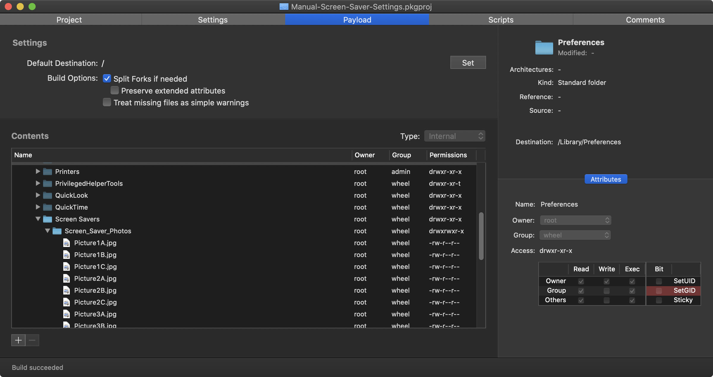

# Screen Saver Settings

## Managed Settings

- Deploy `com.apple.sceensaver.mobileconfig` from JamfPro or any other MDM that supports uploading custom profile plists.
- Copy and paste `com.apple.screensaver-WSO.plist` into the "Custom Settings" profile payload in WorkspaceONE.

    **NOTE**: Make sure that the `PayloadUUID` does not match other existing profiles.

    ```xml
    <dict>
        <key>PayloadOrganization</key>
        <string>Avengers</string>
        <key>PayloadType</key>
        <string>com.apple.screensaver</string>
        <key>PayloadUUID</key>
        <string>4ac5f8fc-9066-4e81-a863-e273af0bdbac</string>
        <key>label</key>
        <string>com.apple.screensaver</string>
        <key>idleTime</key>
        <integer>300</integer>
    </dict>
    ```

## Manual Screensaver settings

Use the `set-screensaver-settings.sh` script to set the screensaver settings that are not configurable via com.apple.screensaver.plist.

In my testing, the `idleTime`, `tokenRemovalAction`, `askForPassword`, `askForPasswordDelay`, `loginWindowModulePath`, `moduleName`, and `CleanExit` settings are the on options that are manageable through the main com.apple.screensaver plist.

The ByHost directory under the user's ~/Library/Preferences/ByHost path manages the other settings. As such, they are not modifiable when deployed via mobileconfig.

Three other plist files aid in managing the Screensaver settings.

    - com.apple.screensaver.machine_UUID.plist
    - com.apple.ScreenSaverPhotoChooser.machine_UUID.plist
    - com.apple.ScreenSaver.iLifeSlideShows.machine_UUID.plist

Other screensaver styles can have their own plist in the ByHost directory. The iLifeSlideShows manages the Classic style.

Make sure to test in your environment.

### Package Payload

Here is what the package looks like using Packages.app

1. Payload

    

2. Post-install script

    
